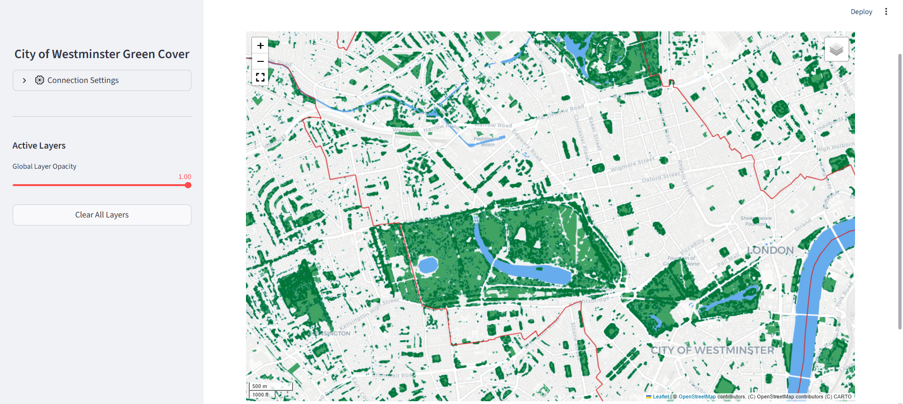

# Streamlit UI for Visualising Geospatial Data from AWS 



## Overview

This is a Streamlit application designed to visualize geospatial S3 data served from a custom AWS API Gateway and Lambda backend, built as a full-stack portfolio piece.

The Streamlit frontend fetches data from a specific container (either run locally or hosted on AWS) which may be configured using the sidebar settings. For information on the container, please visit the [github repo](https://github.com/Cenan-Alhassan/geospatial_aws_server.git).

## Tech Stack

* **Frontend Framework:** Streamlit
* **Mapping & Visualization:** Folium, Leafmap
* **Geospatial Processing:** GeoPandas, Rasterio
* **Dependency Management & Tooling:** `uv` (for rapid dependency resolution and environment management) and `ruff` (for strict linting and formatting), orchestrated via the `pyproject.toml` standard.

## Quickstart

Getting the project running locally takes less than a minute thanks to the `uv` package manager.

1. **Clone the repository**
   ```bash
   git clone [https://github.com/Cenan-Alhassan/streamlit_geospatial_aws_interface.git](https://github.com/Cenan-Alhassan/streamlit_geospatial_aws_interface.git)
   cd streamlit_geospatial_aws_interface

2. **Sync dependencies and build the environment**
   ```bash
   uv sync
3. **Launch the application**
   ```bash
   uv run streamlit run src/app.py

## Configuration

By default, the application is configured to connect to the live AWS API Gateway endpoint. You can modify the backend connection directly from the application UI.

1. Open the sidebar menu.
2. Expand the **Connection Settings** panel.
3. Update the **API Base URL** to point to your local Docker container (e.g., `http://localhost:9000`) or a different AWS endpoint, as long as the container works shown here: https://github.com/Cenan-Alhassan/geospatial_aws_server.git.
4. Click **Update Connection** to refresh the data explorer.

## Repository Structure

The frontend codebase is modularized to separate UI components, API logic, and styling configurations.

```text
streamlit_geospatial_aws_interface/
├── src/
│   ├── app.py                 # Main Streamlit application and map rendering loop
│   ├── api_client.py          # Handles S3 fetching, Lambda emulator routing, and Base64 conversions
│   ├── models.py              # Pydantic/Dataclass definitions for type safety
│   ├── components/
│   │   └── sidebar.py         # UI components for settings
│   └── config/
│       └── styles.py          # Dictionary-based theming engine for vector layers
├── pyproject.toml             # Project metadata and tool configurations (ruff)
├── uv.lock                    # Deterministic dependency resolution
└── README.md